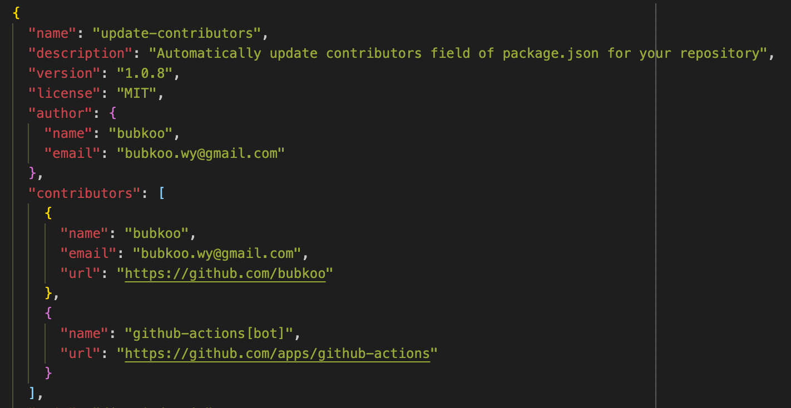

<h1 align="center">Update Contributors</h1>
<p align="center"><strong>Automatically update <a href="https://docs.npmjs.com/cli/v7/configuring-npm/package-json#people-fields-author-contributors">contributors field</a> of <code>package.json</code> for your repository</strong></p>



## Usage

Create a workflow file such as `.github/workflows/contributors.yml`:

```yml
name: Contributors
on:
  schedule:
    - cron: '0 1 * * 0' # At 01:00 on Sunday.
  push:
    branches:
      - master
jobs:
  contributors:
    runs-on: ubuntu-latest
    steps:
      - uses: actions/checkout@v2
        with:
          fetch-depth: 0
      - uses: wow-actions/update-contributors@v1
        with:
          GITHUB_TOKEN: ${{ secrets.GITHUB_TOKEN }}
```

### Inputs

Various inputs are defined to let you configure the action:

> Note: [Workflow command and parameter names are not case-sensitive](https://docs.github.com/en/free-pro-team@latest/actions/reference/workflow-commands-for-github-actions#about-workflow-commands).

- `sort`: Specify if sort contributors by contributions or not. Default: `true`.
- `exclude_users`: Users separated by space to exclude in the contributors list.
- `include_bots`: Specify if include bots in the contributors list or not. Default `true`.
- `include_collaborators`: Specify if include collaborators or not. Default `true`.
- `affiliation`: Specify the type of collaborators. Default: `direct`. Options: `all/direct/outside`.
  - `'outside'`: All outside collaborators of an organization-owned repository.
  - `'direct'`: All collaborators with permissions to an organization-owned repository, regardless of organization membership status.
  - `'all'`: All collaborators the authenticated user can see.
- `commit_message`: Commit message of the github action. Default: `'chore: update contributors'`

## License

The scripts and documentation in this project are released under the [MIT License](LICENSE).
